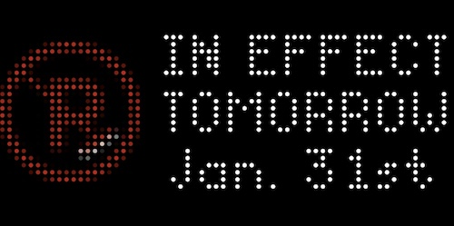

# NYC ASP Status
This app displays the current status of New York City alternate side parking (street cleaning) rules, which may be suspended due to inclement weather (such as snow removal operations) or because of observed legal or religious holidays.

- The street cleaning logo on the left is red when ASP rules are in effect, and turns green when rules are suspended or not in effect.
- The following day's status is shown after 3PM EST/DST.
- The app can be configured to only be shown when alternate side parking rules are suspended or not in effect.

Data is sourced from the NYC 311 API (https://api-portal.nyc.gov/)
