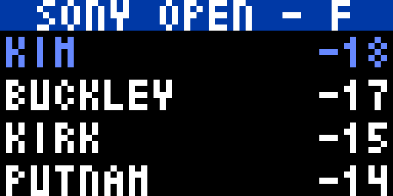

This app displays the leaderboard for the current PGA Tour event, taken from ESPN data feed updated every minute. 

The leaderboard will show the first 24 players. Players currently on course are shown in different shades of yellow - going from dark yellow for those players just starting to white for those who have completed their rounds. Players who have not started are shown in green.

Before the tournament commences it will show the following screen

During the tournament

After the tournament has finished, the winner will be in blue

