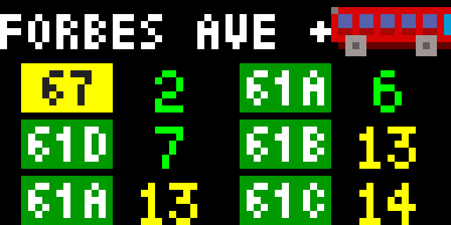

# Pittsburgh Regional Transit Bus Times

This app displays the estimated times for buses at a given stop that are run by the Pittsburgh Region Transit system (formerly the Pittsburgh Port Authority). The stop that is displayed is configurable in the Tidbyt app. The idea is that you set the stop to one near where your Tidbyt is, or a stop that you use often, and then you can see at a glance when the buses will arrive at that stop.

At most the next 6 buses that will arrive at the stop are displayed. 

## Color Scheme

The times are colored by their magnitude: green for busses that will arrive in < 10 minutes, yellow for busses that will arrive between 10 and 19 minutes, and red for busses that will arrive in 20 or more minutes. The buses are always sorted (top-to-bottom, left-to-right) based on their arrival time.

The backgrounds of the bus route numbers (e.g. 61C) are colored by the reported number of people currently on the bus: red for "FULL", yellow for "HALF EMPTY", and green for "EMPTY". The  thresholds for these categories are set by the PRT. "HALF EMPTY" is displayed as "Somewhat crowded" in the PRT webapp. A "FULL" bus does not mean it can't hold  more people (see, e.g., 61C on a rainy day on Forbes...).

## Bus Icon

The bus icon in the top right is mostly to remind you that this is a bus tracking app. The direction of the bus is the direction of the buses traveling at the stop: a bus icon driving left is going INBOUND (toward downtown) and a bus icon driving right is going OUTBOUND (away from downtown).

This is just a hint about the bus directions --- don't rely on it too much. For example, when no busses are reported to arrive soon, the icon always points INBOUND. If both inbound and outbound busses will arrive at a stop (can this happen?), an arbitrary direction is chosen for the icon.

## Special cases

If the number of the people on the bus is unknown, it is colored as if it was reported "FULL". 

As with the standard PRT apps, if the bus time is <= 1 minute, it is displayed as "DUE".

If the time to a bus is longer than 999 minutes, the time is displayed as "?". In any case, if your bus won't arrive for >999 minutes, the exact time is probably not that important.

## Configuration

The Tidbyt app lets you set the stop number that will be displayed. This should be the number that is present on the bus stop sign (e.g. 7117).

You can also limit display to particular routes at the chosen stop. For example, if you are only interested in 61C and 61D at a stop that services all the 61x buses, you can enter "61C,61D" (case insensitive, spacing insensitive, comma-separated) in the "Routes" configuration box to only show buses on those routes.  By default, all the buses that will stop at the stop are shown.

## Limitations

The app does not know about "discharge only" stops --- stops, such as some 28X stops, where people can only get off, and not get on. It will display buses at these stops like any other.

## Disclaimer

This app has no association with the PRT or the City of Pittsburgh. 

It was written as an fun exercise because I often need to known when buses will arrive at  stops near me. The data is obtained through the official PRT REST API, and I cannot vouch  for the accuracy of that data (though it seems to be pretty good usually).

## Contact

I can be reached at <tt>carlk@cs.cmu.edu</tt>.
