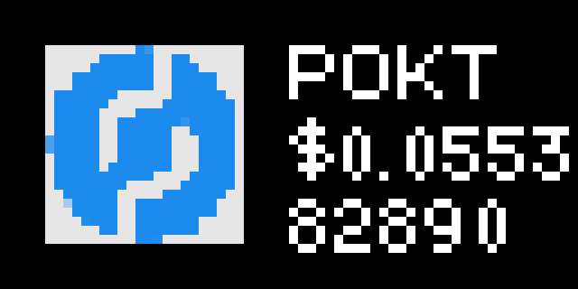

# POKT Stats applet for Tidbyt

Displays the current USD/POKT token price sourced from coinstats, as well as the latest block height from PNI's public endpoint. Block height updated every 10 minutes (15 minute block times), and price every 2 hours. No API key required. [POKT](https://www.pokt.network) is a decentralized network that provides RPC access to the most popular Web3 systems and chains.

