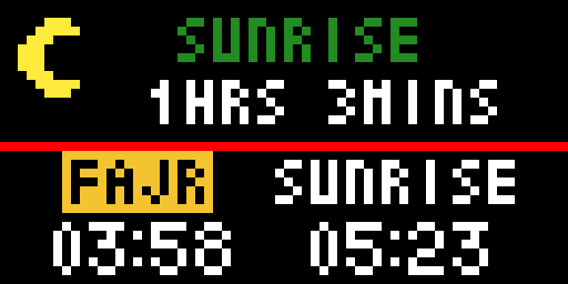

# Islamic Prayer Times

This app displays the prayer times for today's date based on the user location and the method of prayer time calculation. The location, timezone and prayer time calculation method are configurable in Tidbyt app based on the user input.

## Color Scheme

The day's prayer times are shown in the lower half of the screen and colored in white. The current prayer name is highlighted in yellow in the lower half of the screen. The upper half of the screen shows the remaining time till the next prayer and its colored in green.

## Day Icon

The Sun/Moon icon in the top left is indicating the current time of the day either Day or Night.

## Configuration

The Tidbyt app lets you set the location that prayer times will calculated based on it. Also you can set the method of the prayer times calculation, you can pick it from dropdown list.

## Disclaimer

This app shows the prayer times based on [Adhan API's](https://aladhan.com/).

It was written as a fun exercise because I often need to check prayer times.

## Contact
