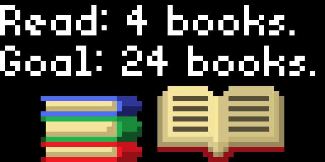

# Goodreads yearly reading challenge progress 

Displays the progress of your reading challenge along with different icons to illustrate how many books you've read thus far.

## Goodreads.com

Goodreads had killed off its public API in 2020. Given what I am calling a challenge ID (not a user ID) https://www.goodreads.com/user_challenges/{challenge_id} will serve up any public profile's yearly reading challenge. Schema takes a challenge ID from the user. The app makes a GET request to https://www.goodreads.com/user_challenges/{challenge_id and parses the returned HTML using starlark's regex libary to pull reading progress and goals from a div entitled 'progressText'.

Parsing HTML is more fragile than making a real API call.