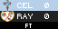
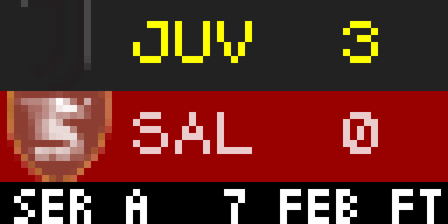

# Men's soccer tournament / league

Men's soccer displays upcoming / current / completed games for tourname / league you have selected

Displayed:

- Home / Away Teams & current standings
- If future game: Date & Time of upcoming game
- If inprogress game:  Score & Time
- If past game:  Final Score

## Configuration
- Select League / Tournament to display.  Current Leagues / Tournament options are:
    * Dutch Eredivisie
    * English Carabo Cup
    * English FA Cup
    * English League Championship
    * English League One
    * English League Two
    * English National League
    * English Premiere League
    * French Ligue 1
    * FIFA World Cup
    * German Bundesliga
    * Italian Serie A
    * Mexican Liga BBVA MX
    * Scottish Premiership
    * Spanish LaLiga
    * UEFA Champions League
    * UEFA Europa League

- Which team to display first (home or away)
- Select display format type
- Select color for time
- Select time to display each score (this eliminates the mult-instance thing we've traditionally done)
- 12 hour vs 24 hour time & US vs Intl date format
- Select if you want to show a range of days forward / back instead of just the default API results & specify how many days forward and back.

## Thanks

Thanks a lot to a bunch of folks who have worked on these various sports apps.  @LunchBox8484 is the original author of many of them.
Thanks to @jesushairdo for the new option to be able to show home or away team first.  Let's be more international :-)

## Screenshot

