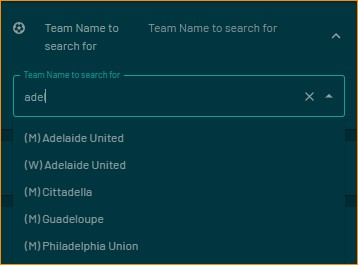
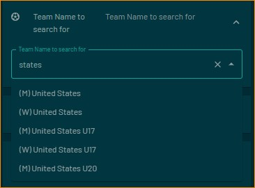

# Track single soccer team across all global tournaments / leagues they are playing in

Single Soccer Team displays upcoming / current / completed games for the single team you have selected - regardless of the league / tournment.  Handles all ESPN API leagues / tournaments.
Approx 3000 teams globally are in this app (2500 men's teams & 500 women's teams - including professional, international and college)

Displayed:

- Home / Away Teams & current record (if applicable for current league / tournament)
- Game's League / Tournament abbreviation
- If future game: Date & Time of upcoming game
- If inprogress game:  Score & Time
- If past game:  Final Score  (as per ESPN API - scores flip over to next game at 1AM US ET - future version coming to assist with this)

## Configuration
- Select Men's/Women's teams to search
- Enter text to search team name (minimum 4 characters)
- Which team to display first (home or away)
- Select display format type
- Select color for time (uses new schema.Color)
- 12 hour vs 24 hour time & US vs Intl date format

## Thanks

Tons of thanks to @whyamihere/@rs7q5 for the API assistance - couldn't have gotten here without you
Thanks to @dinotash/@dinosaursrarr for making me think deep thoughts about connected schema fields
Of course - the original author of a bunch of this display code is @Lunchbox8484
Thanks to @jesushairdo for the option to be able to show home or away team first.  Let's be more international :-)

## Screenshot

## Schema Search for Teams

