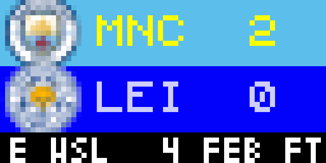

# Women's soccer tournament / league

Women's soccer displays upcoming / current / completed games for tourname / league you have selected

Displayed:

- Home / Away Teams & current record
- If future game: Date & Time of upcoming game
- If inprogress game:  Score & Time
- If past game:  Final Score

## Configuration
- Select League / Tournament to display.  Current Leagues / Tournament options are:
    * Australian A-League Women  ** Cavaet see below
    * CONCACAF W Championship
    * English Women's Champions League
    * English Women's FA Cup
    * English Women's Super League
    * United States NWSL
    * Women's International Friendly
    * Women's Olympics Tournament
    * Women's World Cup

- Select display type
- Select color for time
- Select instance count & instance number **  this slows down the cycle of scores - add multiple instances to spread out the timing of rotation
- Select if you want to show a range of days forward / back instead of just the default API results & specify how many days forward and back.

## Caveat
For some reason, if you select Australian Women's A-Legaue, the API returns no data by default (vs all the other leagues).  If you do NOT select the option to filter by date range,  the app automatically looks 6 days ahead from today.

## Thanks

Thanks a lot to a bunch of folks who have worked on these various sports apps.  @LunchBox8484 is the original author of many of them.

## Screenshot

