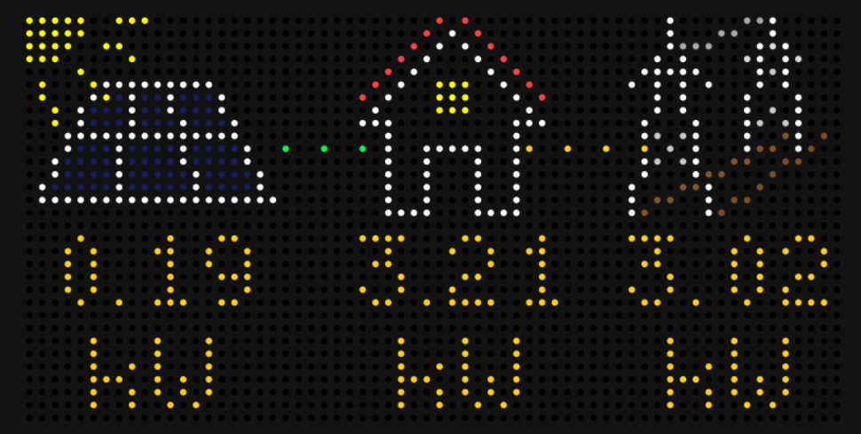

# SolarEdge Monitoring Applet for Tidbyt

Displays real-time solar panel production data from your SolarEdge installation.
Due to the low rate limit of the SolarEdge API, results are only refreshed
every 5 minutes.

You can find yout site ID and obtain a SolarEdge API key via the [monitoring portal].

[monitoring portal]: https://monitoring.solaredge.com

