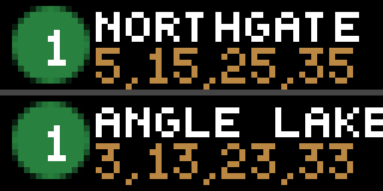

# Sound Transit Applet for Tidbyt

Displays up to 2 different stations in the Sound Transit Link Light Rail network and their associated upcoming trains on your Tidbyt.

Data is provided by the Sound Transit's OneBusAway instance. Docs:
* http://developer.onebusaway.org/modules/onebusaway-application-modules/current/api/where/index.html
* https://www.soundtransit.org/help-contacts/business-information/open-transit-data-otd

