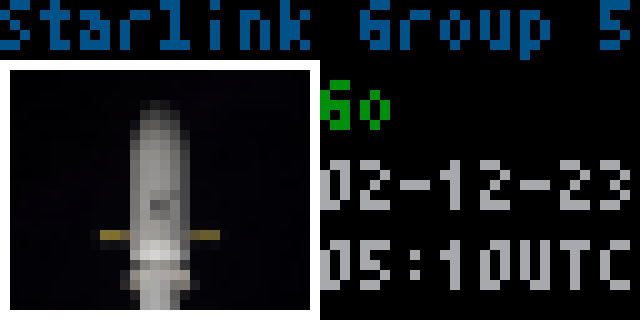
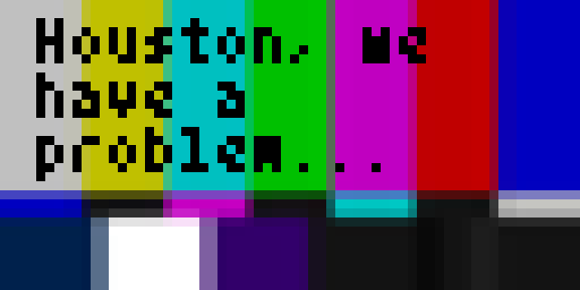

# SpaceX Launch
by [rytrose](https://github.com/rytrose)

SpaceX Launch displays information about an upcoming SpaceX rocket launch. Data is provided by the [Launch Library 2 API](https://thespacedevs.com/llapi).

If you have a [Launch Library 2 API key](https://github.com/TheSpaceDevs/Tutorials/blob/main/faqs/faq_LL2.md#free-and-paid-access), you can change the search query to something other than the default "SpaceX" (the free API has a 15 req/hr rate limit).

## Screenshots
### Normal operation

### Error
