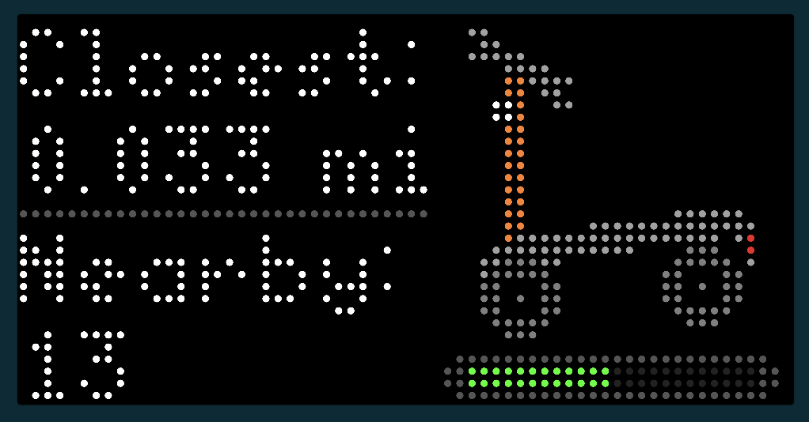
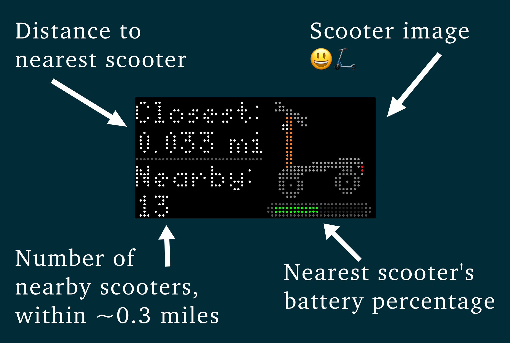

## Spinbyt

App for pixlet device, the Tidbyt, to display information about local Spin scooters. 
Including their locations, battery levels, and number of nearby scooters.

It calls the Spin API that uses the [GBFS standard](https://github.com/MobilityData/gbfs/blob/v2.3/gbfs.md).

## Screenshot

## Explainer

