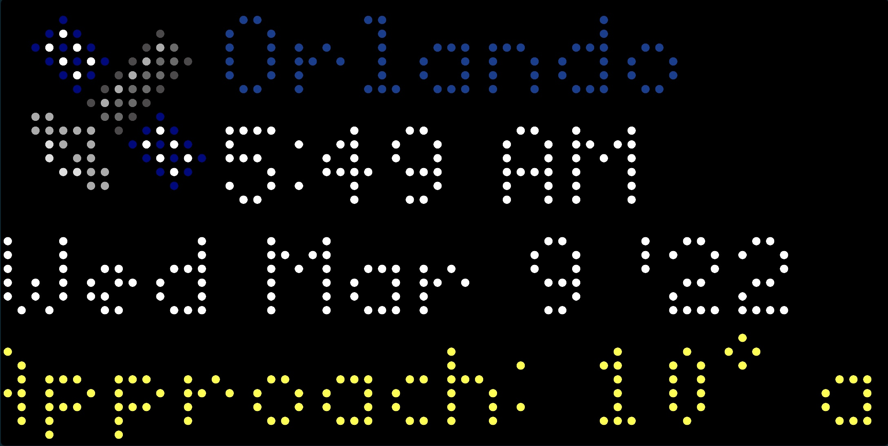

# Spot the Station Applet for Tidbyt

Displays the next viewing opportunity of the International Space Station over your selected location. Get your location specific RSS feed URL: Go to [Nasa's Spot the Station] (https://spotthestation.nasa.gov), use the map tool to find a blue marker nearest your Tidbyt, click "View Sighting Opportunities", then click RSS and save that URL.

