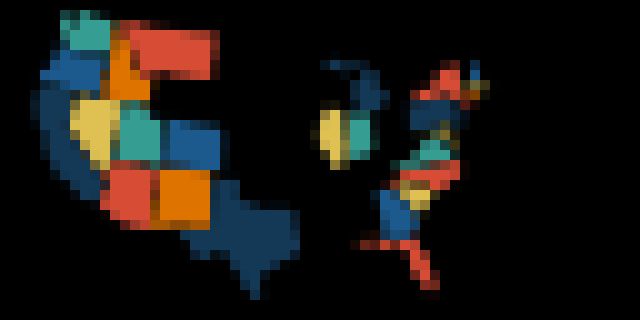

# States Visited

Keep track of the states you've visited and show a fun map
of your progress across the continental US!

## Developer instructions

There is a folder in this directory called state-images/ full of SVGs.
Each state has its own SVG, which can be rendered to a PNG and included in the Starlark applet.
There is an attached script which helps with this process.
If you want to (for example) adjust the color palette, you would make that change to the SVGs, then regenerate the PNGs as base64 in the Starlark.