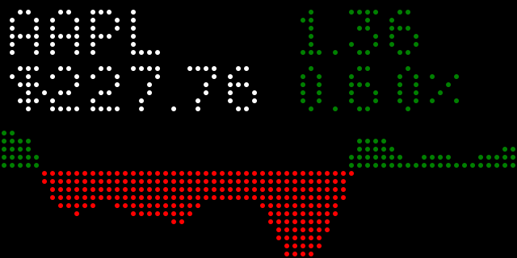

# StockData Ticker for Tidbyt

Allows you to track the value of a stock as a chart with intraday or historical data using data from stockdata.org.

A free API key from https://www.stockdata.org/register allows for 100 daily requests which is enough to get fresh data every 15 minutes. If you create multiple instances of his app, you'll have to reduce freshness accordingly if you want to stay within the free limit.

