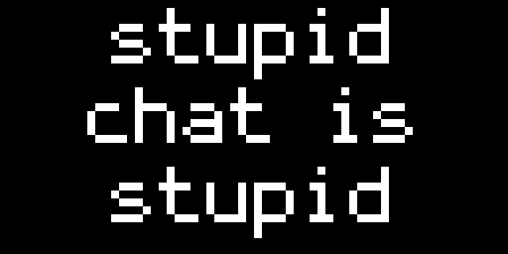

# stupid.chat for Tidbyt

Send messages and pictures to your Tidbyt from anywhere.

Visit https://stupid.chat and click `Get Started`. You will be assigned a
random, unique token for your Tidbyt. Add your stupid.chat token in
the app to link the website to your device. Having done so, you may
send messages or images from the stupid.chat website to your Tidbyt.
Tokens are free, you can always visit stupid.chat and generate a new one.

## Messages

Text has these qualities:

* scrolled vertically or horizontally
* aligned center, left or right
* 5 fonts to choose from: `10x20` (largest) to `tom-thumb` (smallest)
* choice of background and foreground colors

## Images

Images are served at 64x32. The server will do its best to resize larger
images.

## Screenshot

## Share

Your secret stupid.chat URL can be shared with friends and family to allow
them to send updates.

## API

You can use your favorite programming language or command-line tools to
send messages to your your Tidbyt. API documentation is available
[here](https://api.stupid.chat/).

## About this App

* Created 17-Jun-2022 by [harrisonpage](https://harrison.page)
* For updates: [harrison.page](https://bsky.app/profile/harrison.page)
* [About Page](https://stupid.chat/about)
