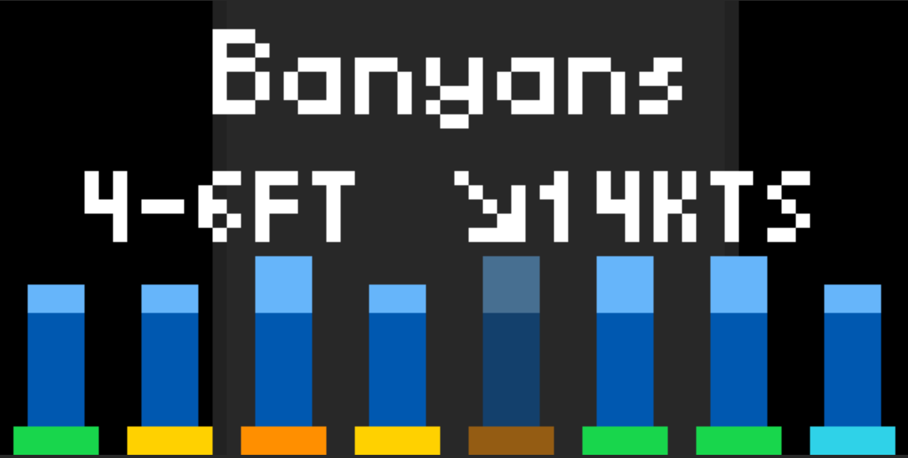

# Surf Forecast App for Tidbyt

Displays the day's surf forecast using data provided by the Surfline API.

Data displayed includes:
  - Spot name
  - Current surf height, wind speed, and direction
  - Sunrise and sunset times (the lighted background of the app)
  - Surf forecast through the day over 8 intervals:
    - Overall surfline rating
    - Min surf height
    - Max surf height

