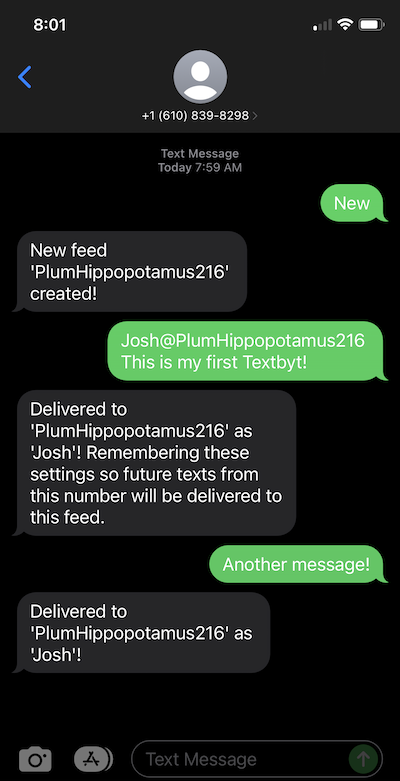

# Textbyt Applet for Tidbyt

Display text messages on your Tidbyt. Great for parties or letting your loved ones know you're thinking about them when you can't be there in person. 


## Getting Started

To get started, text 'new' to 610-TEXTBYT (610-839-8298). The service will reply with a unique feed id. Enter this feed id into your Textbyt app. Anyone you share this feed id with can text messages to your Tidbyt.

To send your first message, start your text with `<name>@<feed id>`. The service will associate the name and feed id with your number so future texts will go to the same Tidbyt.
	


## Privacy

The API and SMS service that powers Textbyt is not affiliated with Tidbyt, Inc. Use at your own risk.

The code for the API is [open source](https://github.com/joshareed/textbyt) so you can inspect what it does. The service stores a small amount of data for each feed: 

```json
{
	"id": "HelloWorld",
	"author": "Textbyt",
	"message": "Welcome to Textbyt, text 'new' to 610-839-8298 to get started!",
	"updated_at": "2022-09-03T23:00:00.489Z"
}
```

And it stores a small amount of data about phone numbers that text it to remember author and feed info:

```json
{
	"id": "+16105551234",
	"author": "Textbyt",
	"feed_id": "HelloWorld",
	"updated_at": "2022-09-03T23:00:00.489Z"
}
```


