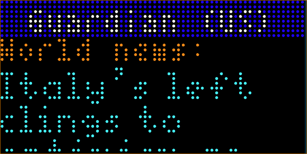

# The Guardian News Headlines

The Guardian News Headlines, uses the [Guardian OpenPlatform API](https://open-platform.theguardian.com/) to display current headline articles (up to 3) for the selected edition.

Displayed:

- Edition
- Article Section
- Article Headline

## Configuration
- Set Edition to display (Australian, International, United Kingdom, United States)
- Select # of headlines to display

## Screenshot

