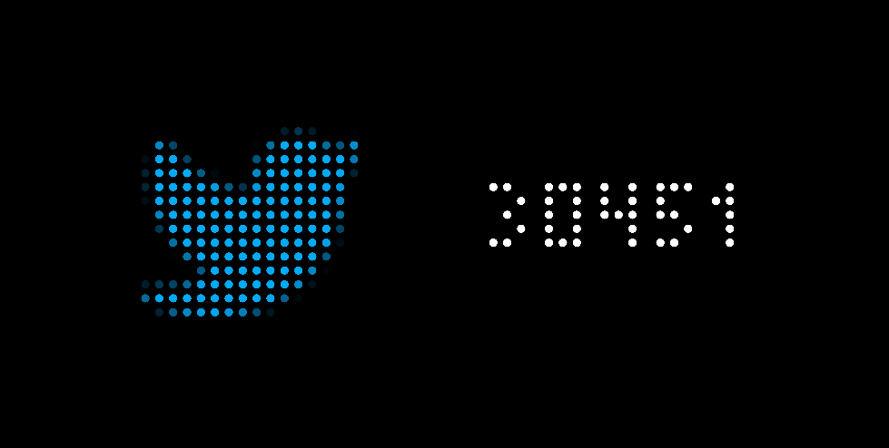
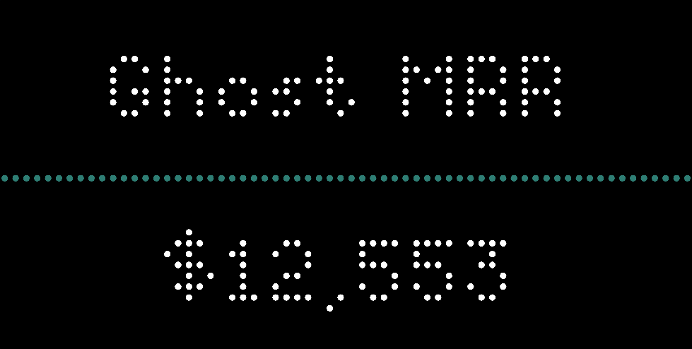
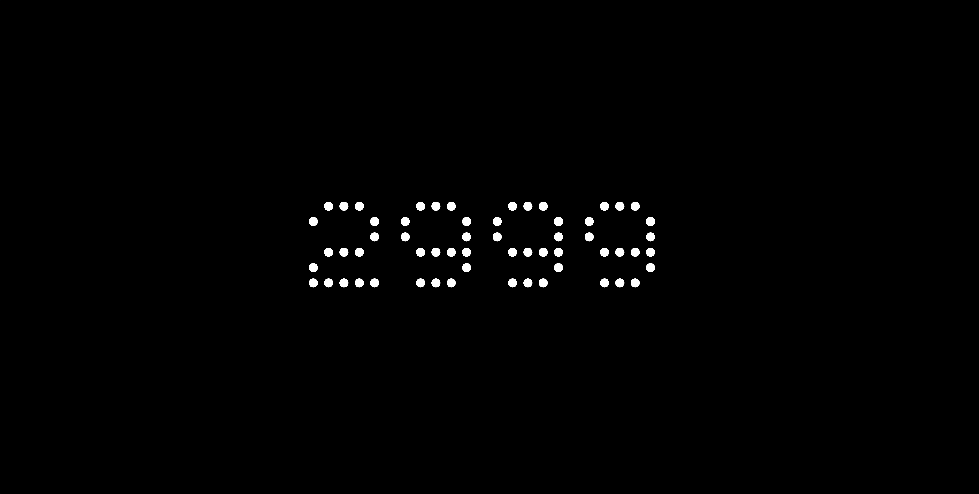

# The Tracker

### Flexible Tidbyt counter to display your numbers via an ilo.so Counter ID.

## Show social & sales numbers

X, YouTube, TikTok, Bluesky, Ghost, Chart Mogul, Beehiiv, Kit, Paddle, Stripe, Fathom Analytics, Simple Analytics, and more.

Data refreshes every 60 minutes.

## Flexible layout, number formatting, colors, icons, and font

## About this app and ilo.so

To use this app, create an account on https://ilo.so/ (creator Dan Rowden) and link your desired account to your dashboard on their site. Open your dashboard and copy the Counter ID into the "Counter ID" field of this Tidbyt app. One ilo.so tracker per Tidbyt screen. Add multiple screens to show multiple trackers. 

Your Counter ID will look similar to this: m1dlbolq

## Ongoing

Happy to add any additonal icons! Most icons are 16px for consistency. A few are 12px. Feel free to send me your desired icon in PNG or Base64.

If you want to find your own icon, I suggest icons8.com's Tiny Color collection: https://icons8.com/icons/tiny-color. These are all 16px pixel perfect icons.

Happy to add addional colors too! Send me a hex color code and your preferred color name.