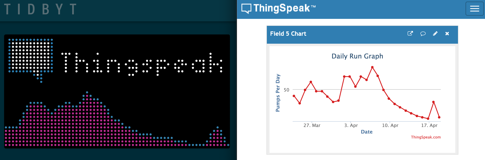

# What is Thingspeak?
[ThingSpeak](https://thingspeak.com/) is an IoT analytics platform service that allows you to aggregate, visualize, and analyze live data streams in the cloud. You can send data to ThingSpeak from your devices, create instant visualization of live data, and send alerts.

# How does this work
1. Creat a Thingspeak account
2. Find a public channel or create a one. Channels can be public or private. Add some data! 
3. View your channel on Thingspeak. You will need the to copy the ChannelId into the Tidbyt applet configuration
4. If your Thingspeak channel is private make sure you visit the API keys tab to get a read key and maybe add a note what its for. In case you intend on using the API in other projects.
5. Add this to the Tidbyt app config
6. Select the field you want to see and how you want the data presented.
7. Enjoy 💬