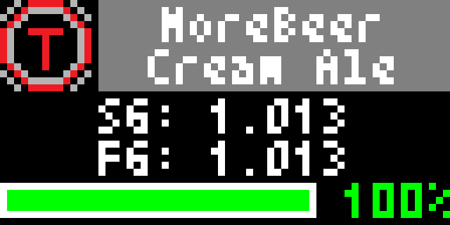

# Tilt Hydrometer
The [Tilt Hydometer](https://tilthydrometer.com) logs and tracks data throughout fermentation via Bluetooth. Log data is published to a Google Sheet generated by Tilt and and shared with a user-specified Google account. This app retrieves the following data from the Sheet and displays it on the Tidbyt:
* **Title** - the name of the brew logged into the spreadsheet. The background will match the Tilt color.
* **SG** (specific gravity) - current observed specific gravity.
* **FG** (final gravity) - estimated specific gravity expected at the end of fermentation.
* **Fermentation Graph** - the percentage of fermentation completed. Once fermentation has reached the FG for > 3 days, the percentage text turns green.
* **ABV** - current observed ABV
* **°F** - average temperature
* **DOB** - the first day of fermentation logs

## Configuration Schema
In order to pull data from your Tilt's Google Sheet, you will need the following:

1. **Shared Sheet** - URL of the Google Sheet that your Tilt is currently logging into.
2. **API Key** - You need a Google API key with access to the Google Sheets API. [Google's instructions for creating an API key](https://support.google.com/googleapi/answer/6158862?hl=en). 
3. **Final Gravity** - The final gravity (FG) that you expect your fermentation to end at. FG should be more than 1.0 and less than your original gravity (OG).

## Screenshots
Display for a Black Tilt hydrometer with a brew name that fits within the title bar (no scrolling). Fermentation in this screenshot is at 9% and ongoing.

Display for a Green Tilt hydrometer with a brew name that does not fit within the title bar (scrolling). Fermentation in this screenshot is also at 9% and ongoing.

Display for a Black Tilt hydrometer with fermentation completed. The 100% text is green, indicating that the FG was reached 3 or more day ago.
