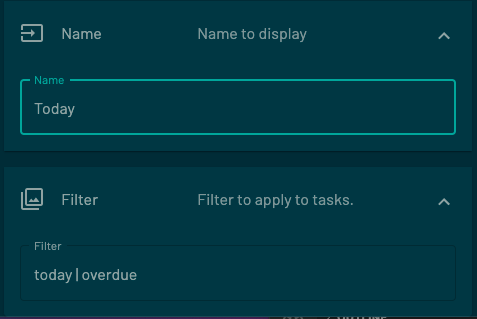

# Todoist Integration for Tidbyt

[Todoist](https://todoist.com/home) is a to-do list and task manager for professionals and small businesses. Combining tasks, projects, comments, attachments, notifications, and more, Todoist lets users streamline their personal and team productivity and work more effectively.

This app displays the number of tasks that you have that are overdue. To use this app, you must have a free Todoist account.

## Customization

This app is customizable. Both the displayed filter name and the filter itself can be adjusted using the properties of the app.

You may adjust the filter that's used to populate the number displayed. Any Todoist filter is supported, see their [Introduction to: Filters](https://todoist.com/help/articles/introduction-to-filters) page for more details.

## Notes

This app is not created by, affiliated with, or supported by Doist.
