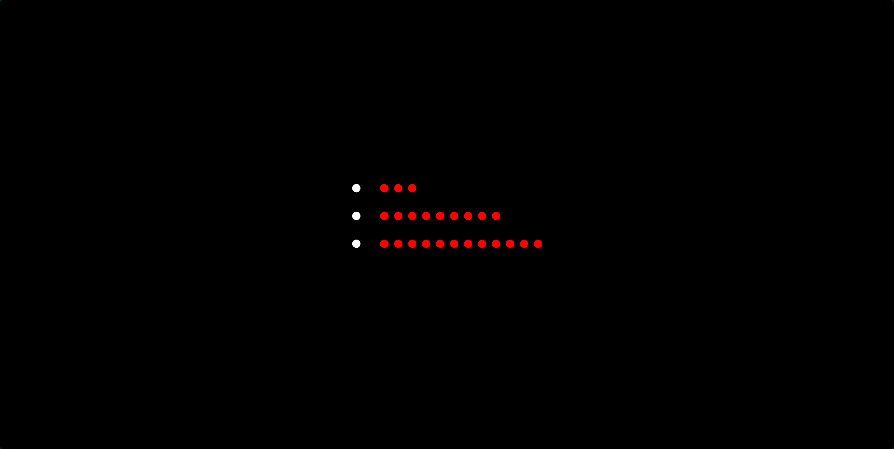
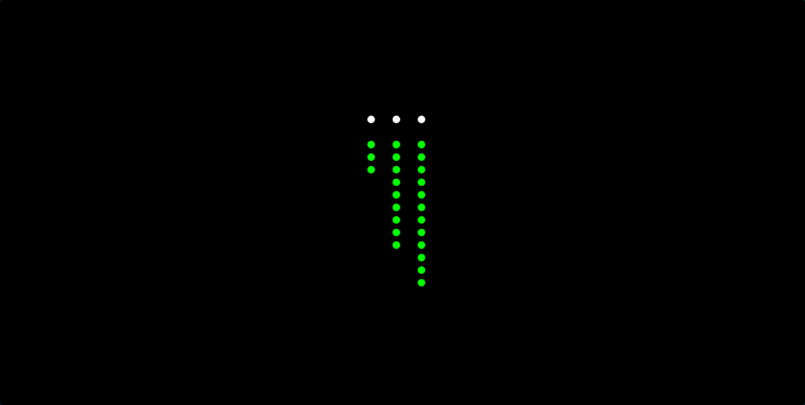
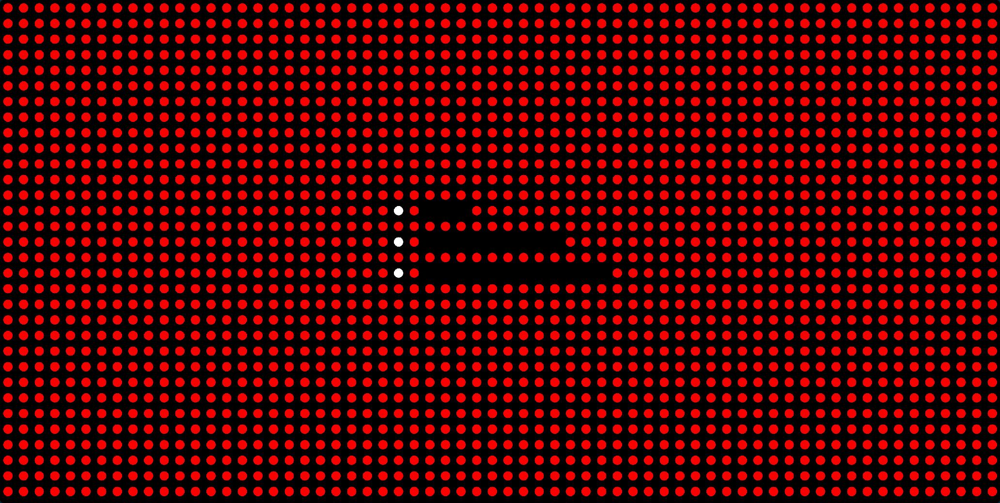
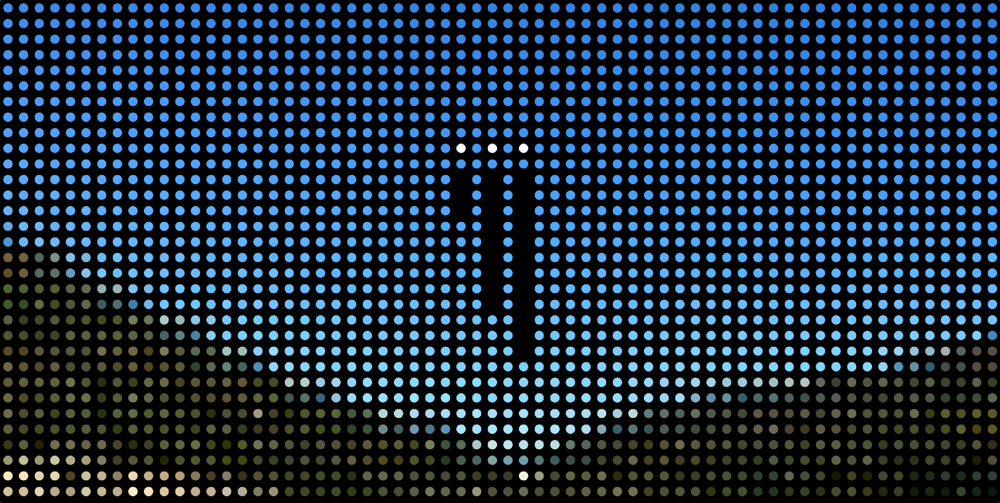

# Todoist Routines for Tidbyt

Shows today's remaining tasks and subtasks as minimalist rows or columns of dots. Great for people with recurring routines of tasks with subtasks to see what's left to do today and whether they've forgotten something. Helps me manage my ADHD symptoms.

Can you make the screen go blank?

* Requires your free personal [Todoist API token](https://todoist.com/help/articles/find-your-api-token)
* Tasks and subtasks can be rendered as rows or columns
* Supports custom dot colors
* Supports custom background color or image
* Works best with smaller numbers of parent tasks (routines) and larger numbers of subtasks

---

Created by [Shannon Moeller](https://github.com/shannonmoeller)