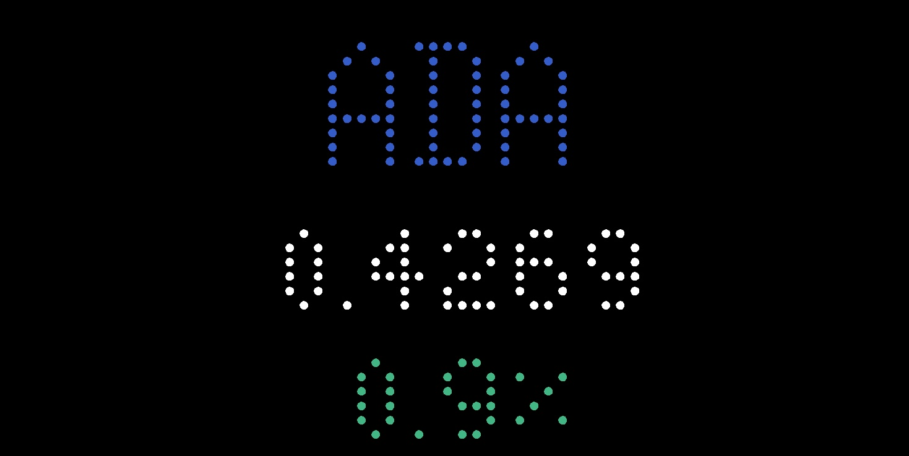
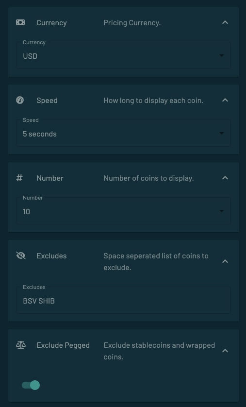

# Top Crypto Prices

This app shows the latest prices and 24hr price changes for the top cryptocurrencies.

Prices can be displayed in many currencies, and certain coins can be excluded.

It is a very simple app, but does exactly what I needed for myself, and why I bought the Tidbyt in the first place. Since there was no app that could do what I had hoped for, I wrote one myself.

Prices are updated through the free [CoinGecko](https://www.coingecko.com/) API at a maximum rate of once per minute. This fits well within their [Free API Plan](https://www.coingecko.com/en/api/pricing). No API key required.

The gif animation shows a full animation loop, but looks kind of ugly compared to the PNG image above, which shows what the fonts look like on the Tidbyt.

More than 20 fiat currencies to display prices in. All ticker symbols are colored after the coin logo colors. Stable coins and wrapped coins are excluded by default, but can be switched on. Further options to control rotation speed, number of coins, and manual excludes.

Enjoy,  
Jeroen Playak  
2022-11-09
