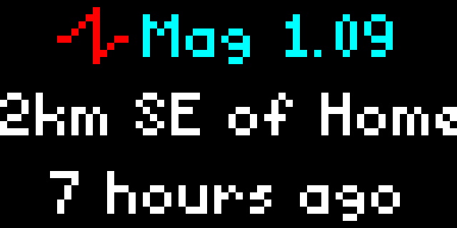

# USGS Earthquakes Applet for Tidbyt

Displays up to three earthquakes that have occurred during the past 24 hours, based on a configurable location. Supports settings for what radius to check and what minimum magnitude to consider. Data is provided by the [USGS GeoJSON Summary Feed ](https://earthquake.usgs.gov/earthquakes/feed/v1.0/geojson.php). Updated every five minutes.

