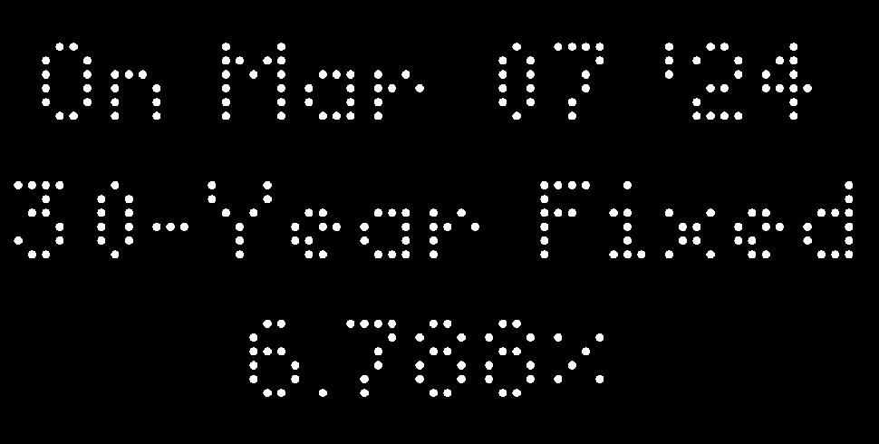

# Average US Mortgage Rates Tracker

## Configuration

Generate your own personal API key from [https://fredaccount.stlouisfed.org/apikeys](https://fredaccount.stlouisfed.org/apikeys) (make a free account if you don't have one already)

This currently can track the following mortgage types:
- [30-Year Fixed Rate Index](https://fred.stlouisfed.org/series/OBMMIC30YF), updated daily (OBMMIC30YF)
- [30-Year Fixed Rate Jumbo Index](https://fred.stlouisfed.org/series/OBMMIJUMBO30YF), updated daily (OBMMIJUMBO30YF)
- [15-Year Fixed Rate](https://fred.stlouisfed.org/series/MORTGAGE15US), updated every Thursday (MORTGAGE15US)
- [30-Year Fixed Rate](https://fred.stlouisfed.org/series/MORTGAGE30US), updated every Thursday (MORTGAGE30US)

## TODO
- [ ] Add animation/graphical tracker over selectable time period

## References 
Uses the free [https://fred.stlouisfed.org/](https://fred.stlouisfed.org/) economic data and API
