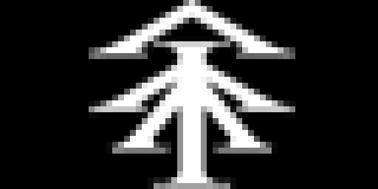

# Valyrian Glyphs for Tidbyt

Display a random glyph and translations from the High Valyrian language, as featured in HBO's _Game of Thrones_ and _House of the Dragon_.

## Contributions
High Valyrian was created by [David J. Peterson](https://wiki.languageinvention.com/), who adapted the language for the Tidbyt display.
Coding was completed by [frame-shift](https://github.com/frame-shift).
