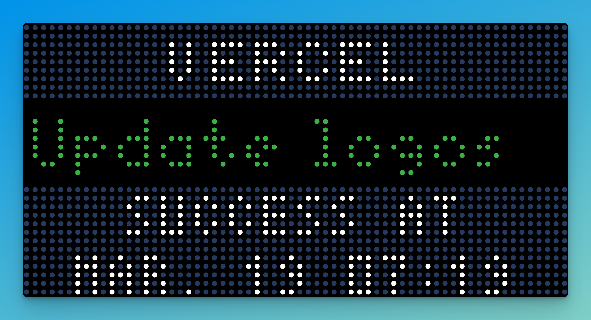

# Vercel Dashboard

This Vercel dashboard allows you to see the latest deployment and some relative information about it.

Currently, it shows:

- Commit message
- Project name
- Author name
- Success/Failure
- Time it was created

In order for it to work, you will need a Vercel API Token. You can read [Vercel's Documentation](https://vercel.com/docs/rest-api#creating-an-access-token) on how to create one.

## Configuration

| Title    | Description                    | Required | Default |
| -------- | ------------------------------ | -------- | ------- |
| API Key  | Your Vercel API Key            | Yes      | --      |
| Timezone | Timezone to show build time at | No       | UTC     |
| 24hr     | Show time as 24hr (13:04)      | No       | True    |
