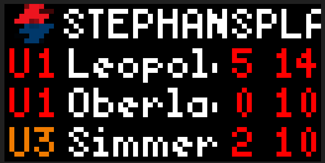
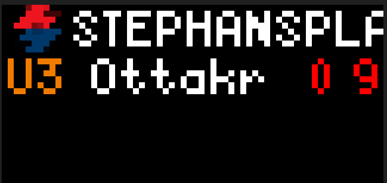

# Real Time Departures for Public Transport Stops in Vienna

With this app, users can choose up to for stops of Viennas huge public transport system for which real time departures will be displayed.
The app features an animation where each stop is featured with a seperate display.

On each display, the following is shown:

- Vienna Public Transport Service (Wiener Linien) Logo 
- Name of the stop the user wants the departures of
- A row for each departure at the stop which is given by line, destination and departure times

In Vienna, a stop can have multiple departures. In the example we chose the stop 'Stephansplatz' which features 2 metro lines (U1/U3) in two directions.
Hence, a total of 4 departures is given.
To ensure that all departures are visible, a maximum of 3 departures is shown per display.
If the number of departures exceeds this, a new display is rendered.

If the user chooses to display more than one stop, a new display is rendered for the new stop.

Furthermore, the user can choose how fast the animation should jump to the next disply.

Note that texts and instructions in for the user configuration is in German since it is anticipated that mainly people living in Vienna - hence able to speak at least basic German - will use this app.

## Screenshot

