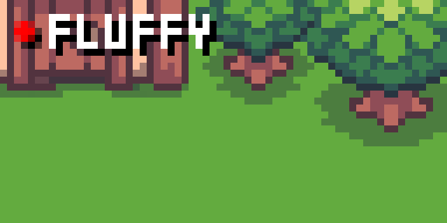

# Virtual Pets for Tidbyt

Choose and name your own pet while watching the environment change with the seasons and time of day!

## Image attribution
**Environments**

Assets that form the backgrounds are © 2024 by [Franuka](https://franuka.itch.io/) and licensed under [CC BY 4.0](https://creativecommons.org/licenses/by/4.0/). The backgrounds were spliced together from these packs and, at times, resized from the originals.
- [Fantasy RPG Asset Pack](https://franuka.itch.io/rpg-asset-pack)
- [Fantasy RPG Snow Pack](https://franuka.itch.io/rpg-snow-tileset)
- [Fantasy RPG Halloween Pack](https://franuka.itch.io/fantasy-rpg-halloween-pack)
- [Fantasy RPG Interior Pack](https://franuka.itch.io/fantasy-rpg-interior-pack)

**Animals**

Assets that make up the animals are © 2024 by [Elthen](https://elthen.itch.io/) and licensed under [CC BY-NC 4.0](https://creativecommons.org/licenses/by-nc/4.0/) with [supplement permissions](https://www.patreon.com/posts/licensing-27430241). The animals have been converted to animated GIFs from static PNGs.
- [Cat](https://elthen.itch.io/2d-pixel-art-cat-sprites)
- [Wolf Cub](https://elthen.itch.io/2d-pixel-art-wolf-cub-sprites)
- [Penguin](https://elthen.itch.io/2d-pixel-art-penguin-sprites)
- [Parrot](https://elthen.itch.io/2d-pixel-art-parrot-sprites)
- [Turtle](https://elthen.itch.io/2d-pixel-art-turtle-sprites)
- [Compsognathus](https://elthen.itch.io/2d-pixel-art-compsognathus)
- [Hedgehog](https://elthen.itch.io/2d-pixel-art-hedgehog-sprites)
- [Skunk](https://elthen.itch.io/2d-pixel-art-skunk-sprites)
- [Raccoon](https://elthen.itch.io/2d-pixel-art-raccoon-sprites)
- [Fox](https://elthen.itch.io/2d-pixel-art-fox-sprites)