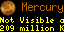

# VisiblePlanets for Tidbyt

Pick a planet, and this app will display information on the direction you need to face, and the number of degrees you need to look up. It will also tell you how bright it is, is relative magnitude and explain what that means. It will also tell you if you need to wait till sunset, and will also tell you when sunset is for your location. It will also tell you the constellation the planet appears in.

For inner planets (mercury, venus), you can see these just before and after sunrise and sunset at times. Since their orbits are close to the sun, they will always be near the sun. When they aren't directly behind or in front of the sun, they can be seen in the morning or evening hours for a short time. Outer planets you'll usually need to wait until it is dark. The application will provide guidance, like telling you the planet will be easier to see after sunset in those cases.

You can have the app skip displaying information for planets that are below your horizon by selecting "Hide when the selected planet is not visible".

If you want to track more than one planet, I'd suggest installing this app once per planet you want to track, have it skip when not visible because it is below the horizon. You could set the hours of the applciation to only run during evening hours, but there is logic to cache the data until it makes sense to check again, so there won't be too many unneccesary API calls.

