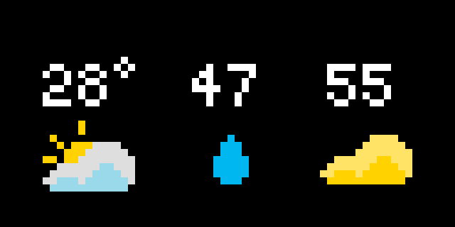

# Weather Snapshot

## Overview

The Weather Snapshot app displays current temperature, humidity, and AQI data, based on the [OpenWeather One Call API 3.0](https://openweathermap.org/api/one-call-3) and [Air Pollution API](https://openweathermap.org/api/air-pollution).

## Details

- **Temperature** - the temperature is displayed in Fahrenheit, with icons for weather conditions that are clear, partially cloudy, cloudy, foggy, rainy, thunderstorming, and snowy.
- **Humidity** - the humidity comes with icons for normal (0-70%), high (70-85%), and very high humidity (>=85%).
- **AQI** - the AQI is calculated from pollutant data, according to [standard AQI formulas in the USA](https://www.airnow.gov/sites/default/files/2020-05/aqi-technical-assistance-document-sept2018.pdf). The icons for AQI include good (0-50), moderate (51-100), unhealthy (101-150), and very unhealthy (>150).

## Caching

This app caches results for 6 hours, in order to reduce the number of calls to the OpenWeather One Call API. Furthermore, the API key associated with the app is limited to 1000 calls per day, meaning the app can support at most 250 installations.

