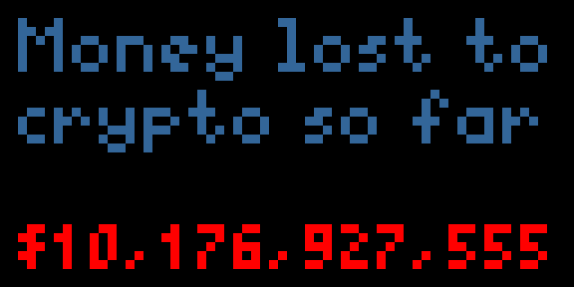

# Web 3 Counter

## [Web 3 Is Going Great](https://web3isgoinggreat.com/)

Polls W3IGG for the current amount of money lost and displays it. It could probably use some polishing, but it seemed like a good starter project.

W3IGG (web3isgoinggreat.com) is a satire site that tracks and reports crypto scams, ponzi schemes, rug pulls, and other travesties.



## External APIs used

Just a simple endpoint that [Molly](https://github.com/molly/) [added](https://github.com/molly/web3-is-going-great/issues/486) to [W3IGG](https://web3isgoinggreat.com/api/griftTotal) which returns the total amount, in dollars, that has been lost or stolen by various cryptocurrency scams, rug pulls, and crashes.

Example query:

```bash
$ curl 'https://web3isgoinggreat.com/api/griftTotal'
{"ip":"65.25.96.157"}%
````

## Options

None

## Note

When the total hits 1 trillion, the text is going to overflow. Hopefully it will be a few months, but who knows at this point?
