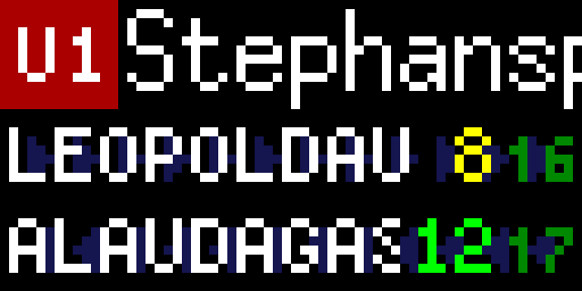

# Tidbyt Wiener Linien Info app

Hi!! Thanks for your interest in this application. 

This App is a simple TidByt app that will help you if you are living in Vienna (Austria) and you need to commute frequently. 

With this App you will get the current time that the especific line of your choice will take to arrive to the station of your choice. You can setup lots of parameters that are dicussed below.

The App will show:
- Header (first line): the station name and transport line in a (hopefully) nice view.
- Content (second and third lines). Each entry will show: 
  - The direction.
  - First departure time in minutes for the line. 
    - **Red**: Hurry! You are almost going to miss it!
    - **Yellow**: You should rush to take it.
    - **Green**: You still have time.
  - Second departure time (next train, bus, tram, etc.) in minutes for the line. 
    - Same color coding, but slightly shadowed and smaller. 

  The color is calculated by the parameter *walking distance* described below.

So basically the example in the image shows that you live near Stephansplatz and you need to rush if you want to take the next train to Leopoldau as it is coming in 8 minutes. If not, you can wait to the next one that will come in 16 minutes. In this example, it is especified a distance of 5 minutes to the station. 

# Before starting

You should know the station and line you would like to monitor and where it is located. Wiener Linien provides maps under this address:
https://www.wienerlinien.at/web/wl-en/maps-and-folders

# Parameters

## Station to monitor

Write an address in Vienna and choose one of the stations in the neighborhood you want to monitor. If you want to add more stations, just add another app instance to your Tidbyt.

Default value is the `Stephansplatz` station.

## Line to monitor

Write the line you want to monitor that passes through the station. Case insensitive for your convenience. It monitors:
- The underground lines (U-Bahn): `U1`, `U2`,...). 
- Trams: 
  - Integer numbers `1`, `2`,... 
  - Some letters: `D`, `O`, ...
  - The `WLB` tram.
  - Special trams due to contructions in U-Bahn: `U2Z`.
- Busses.
  - Normal ones: ***number*** plus an `A` or `B`).
  - Nightlines (`N` plus a ***number***).

The default value is `U1`. If you want to monitor several lines, just add several Apps to your Tidbyt.

***Pro tip***: Some bus lines differs only the last stations (***xx*****A** vs ***xx*****B**) If you do not care which line to monitor (e.g. you get off before the split), just write `X` instead of `A` or `B`. For example `92X` to show the first departures of either **92A** or **92B**.

## Walking distance

Most probably, you will have your Tidbyt far away from the station itself. Because of that, you can specify the time it takes for you to reach the station in *minutes*. This way if there is a bus that is coming in 2 minutes and you specified that you need 5 minutes to reach the station, this entry will be ommited and only the two next valid ones will be shown. 

If you do not want to take this in place, just write a `0` in there. Default value is `5` minutes.

## Aesthetical parameters

### Reverse order

If you specify so, the directions will be interchanged in the display. Default is `false`.

### Destination uppercase

The API used (see legal notice below) returns non U-Bahn directions (bus, trams, etc.) in lowercase. You can keep this or keep the default value `true` to make them uppercase.

### Remove U from the station name

It can be a bit annoying to have a marquee in place only to scroll a trailing **U** or **S** at the end of the station name. So, by default, it is removed (`true`). Set it to `false` if you want to keep it.

# Legal notices

## Open Goverment Data of the City of Vienna

This application uses the Open Government Data of the City of Vienna with the only purpose to be helpful to Tidbyt users that live in Vienna in aim to make the world a better place. 
Open Government Data of the City of Vienna is licensed under a "Creative Commons Attribution 4.0 License" (CC BY 4.0). Full terms [here](https://digitales.wien.gv.at/ogd-nutzungsbedingungen/) (text in German).

Data source: City of Vienna – [data.wien.gv.at](https://data.wien.gv.at)

Datenquelle: Stadt Wien – [data.wien.gv.at](https://data.wien.gv.at)

## Tidbyt Individual Contributor License Agreement

The terms in [this document](https://github.com/tidbyt/community/blob/main/docs/CLA.md) applied to the app when submitted to the Tidbyt Community Repository. 
