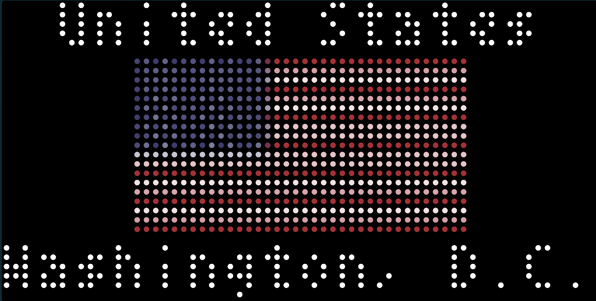

# World Capitals
Displays a country and its capital once per day.

Choose to cycle between all countries or to limit to a region to hone your knowledge. Learn your world capitals with this app!.

Uses [Rest Countries](https://restcountries.com) for getting country information.

