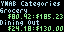
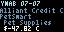

Welcome to the YNAB Tidbyt App!

This app uses the YNAB API (https://api.youneedabudget.com/v1#/) to display your categories in your last used budget that are negative or partially spent for the current month or to display your most recent transactions. These two configurations are displayed separately. 

You will need to supply an access token associated with your YNAB account in order to enable the Tidbyt app's connection to YNAB. The directions for retrieving the token are here (https://api.youneedabudget.com/).

Recent Enhancements:
* Display recent transactions
* Color differentiation if spending is outpacing monthly budget

Possible Enhancements:
* "Pin" categories to always display, regardless of current balance

Categories:

Transactions:

