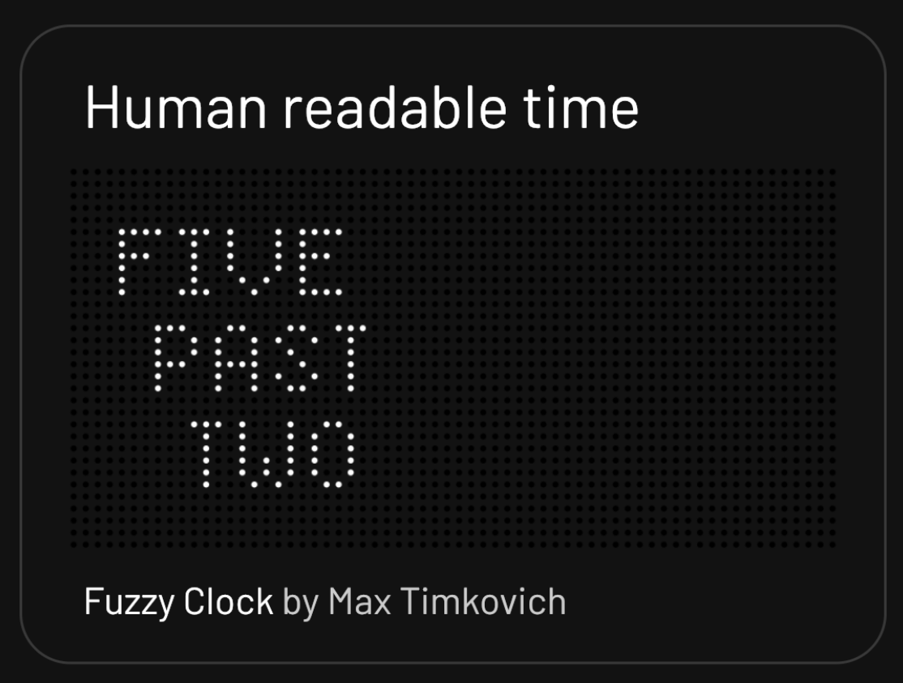
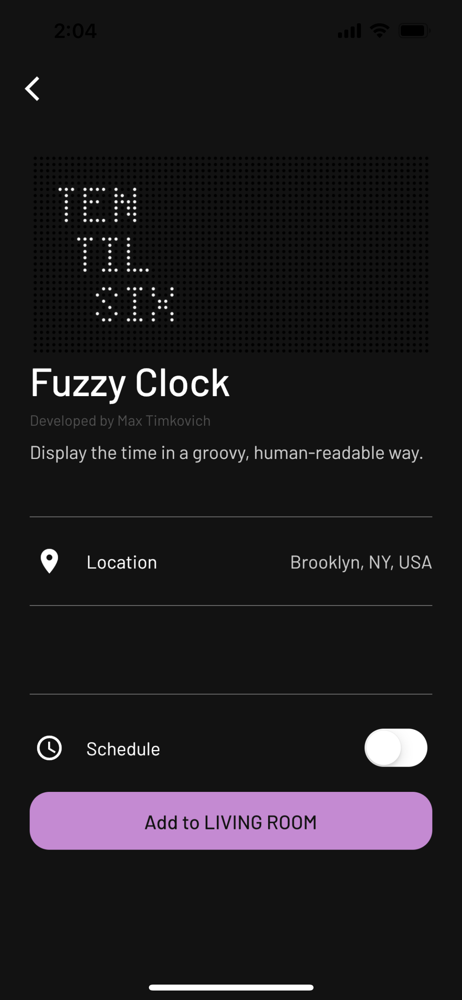
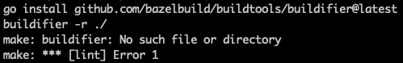

# Publishing Apps
So pumped you're here and want to publish an app! If you haven't done so already, check out our [contributing guide](../CONTRIBUTING.md) and our guide on [app philosophy](app_philosophy.md) to get a better sense of what you're getting yourself into. You'll also want to check out the guide on [authoring apps](https://github.com/tidbyt/pixlet/blob/main/docs/authoring_apps.md) in the pixlet repo to get a better sense of how everything works together.

One final note before we hop in - you may want to check out the [schema docs](https://github.com/tidbyt/pixlet/blob/main/docs/schema/schema.md) if you haven't already. Schema allows you to display options inside of the Tidbyt mobile app so the user can configure your starlark applet.

## Prerequisites
Make sure you have [go1.16](https://go.dev/) or later and `make` installed on your system.


## Quick Start
Fork and clone the [Tidbyt community repo](https://github.com/tidbyt/community) to your local machine, and then run the following from the local folder, to generate everything you need!
```
make app
```

> Note: the codegen tool is a bit picky. This is because these strings show up in the Tidbyt mobile app and we want to ensure the UX works as expected.

Once created, edit `apps/{{appname}}/{{app_name}}.star` with your source code.


## Detailed Instructions

### 1. Fork the Tibyt Community repo on Github

- Community apps are published by making a Pull Request to the community repo here: https://github.com/tidbyt/community
- Start by forking the repo into your Github account.
- After forking you may want to checkout to a new branch to avoid any headaches, and to not have to merge off the main branch of your forked repo.

### 2. Clone the community repo to your local machine

### 3. Install Go if it is not already installed

- Enter `go version` to check if it is already installed.
- If not, download it here: https://go.dev/doc/install
- You may need to restart your Terminal after installing so that the Go install path is recognized. 

### 4. Install Make if it is not already installed

- Enter `make --v` to check if it is already installed.

### 5. Generate the app template files

- Run `make app` via the terminal

This should be run from the 'community' repo folder on your local machine. (The folder containing the Makefile.)
You will be prompted for the relevant information about your app and the required files and folders will be generated.

```
$ make app
Name (what do you want to call your app?): Tides
Summary (what's the short and sweet of what this app does?): Tide charts
Description (what's the long form of what this app does?): Daily tide charts for your location.
Author (your name or your Github handle): Mark Spicer
```

Please note:
- **Name:** The App Name can contain spaces but should not have any numbers
- **Summary:** This should be a VERY brief summary of what the app does. (27 characters or less!)
- **Description:** This is a longer description of what the app does.

#### Example App
In this example, the fields map as follows:
- **Name**: Fuzzy Clock
- **Summary**: Human readable time
- **Description**: Display the time in a groovy, human-readable way.
- **Author**: Max Timkovich






 #### Run your App

 Preview your App in your browser at http://localhost:8080/ by running:

```
pixlet serve --watch apps/{{appname}}/{{app_name}}.star
```

#### Generate a Screenshot

You can generate an enlarged screen render by entering:

```
pixlet render apps/{{appname}}/{{app_name}}.star --gif --magnify 10
```

### 6. Add a Readme File and screenshot to your app folder (Optional)

By including a README.md file and screenshot in your app folder, you will make it easier for other developers to get a better sense of what your app does. See the example [here](https://github.com/tidbyt/community/tree/main/apps/digibyteprice).

### 7. Making a PR

Before submitting your app, run `make lint` from within the 'community' folder to check your code for errors.

Note: If you receive an error like the following, it is probably because the Go binary is not in your path:



You can typically fix this with:
```export PATH=$PATH:$HOME/go/bin```


When you go to make a PR, give us a little background on what your app does. In addition, include a render from the following command so we can ooh-ahh 😍:
```
pixlet render apps/{{appname}}/{{app_name}}.star --gif --magnify 10
```


